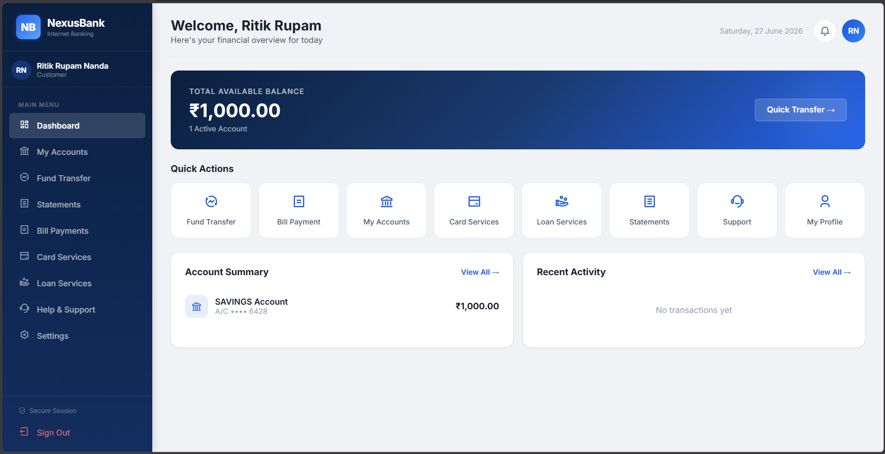
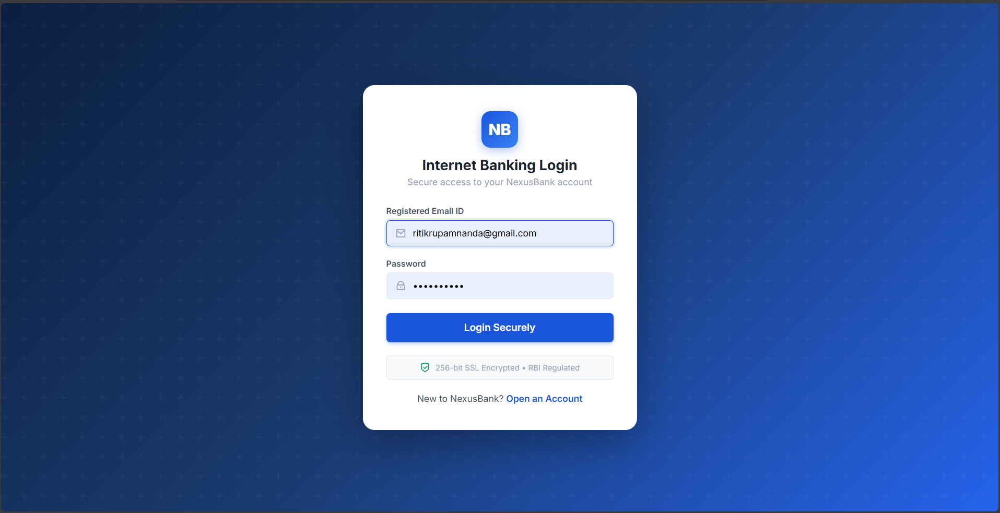
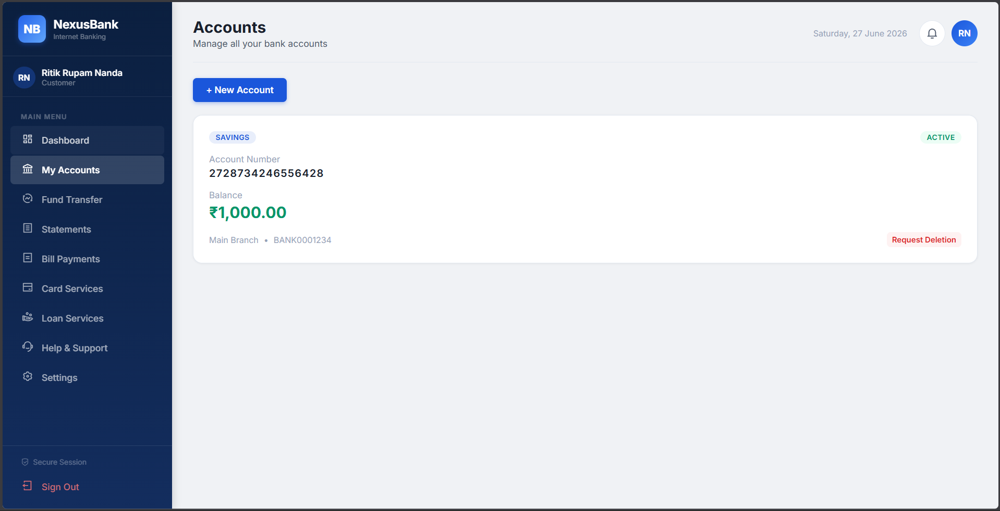
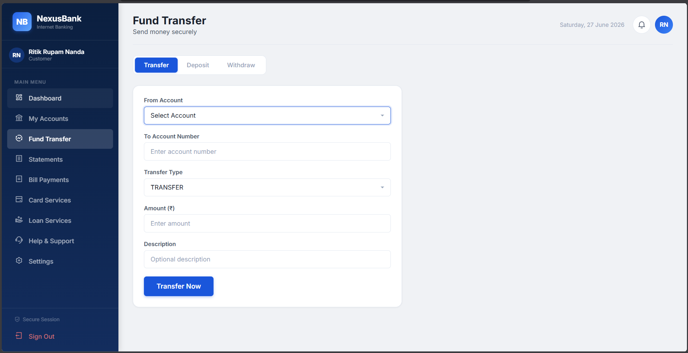
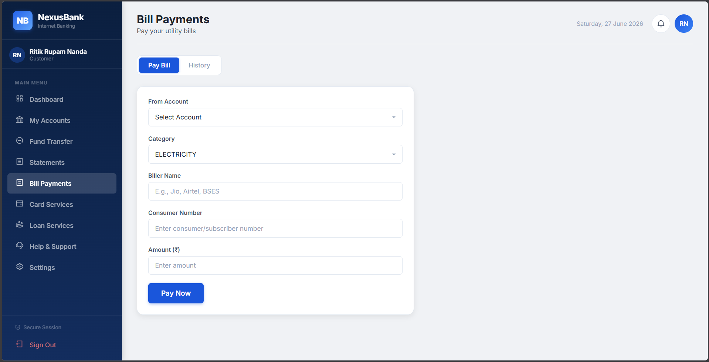
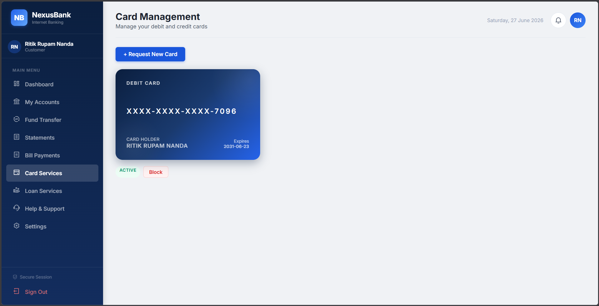
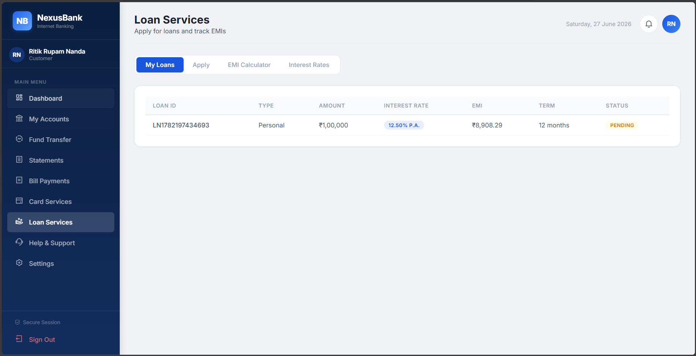
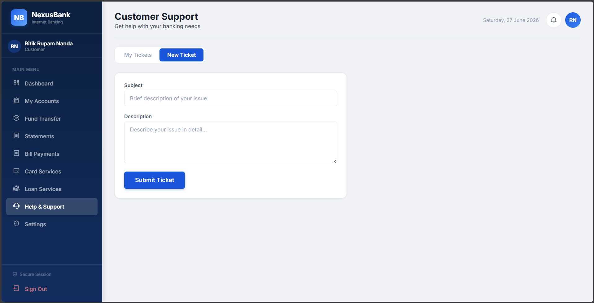
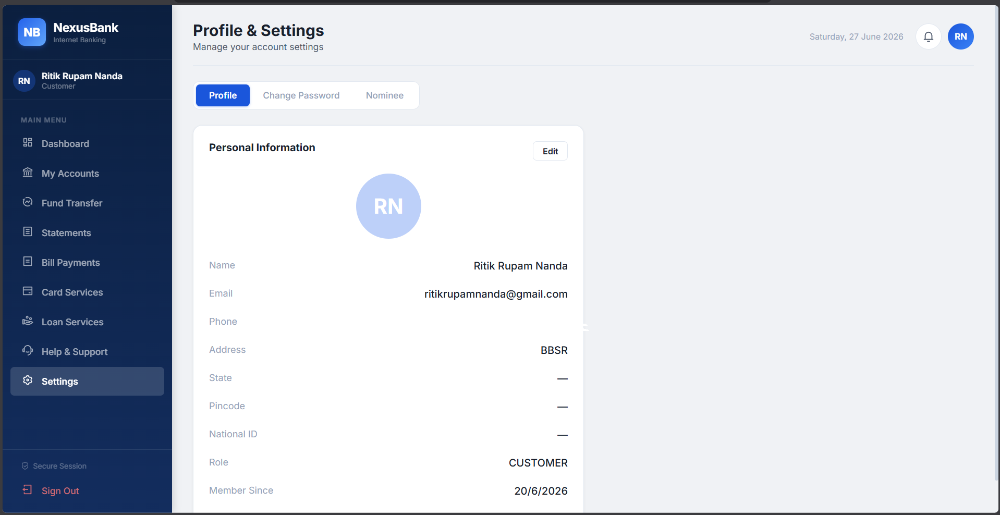
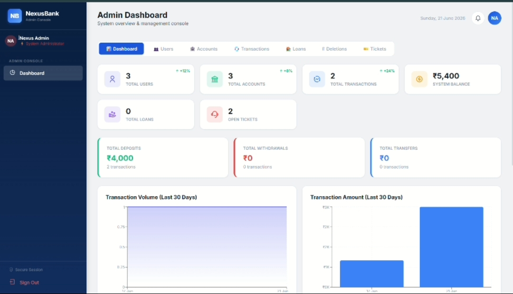

# 🏦 NexusBank

<p align="center">
  <b>Professional Full-Stack Banking Application</b><br>
  Built with Spring Boot, React, MySQL and JWT Authentication.
</p>

<p align="center">


</p>

---

# 📸 Dashboard Preview

<p align="center">

</p>

---

# 🚀 Overview

NexusBank is a modern full-stack banking application designed to simulate real-world digital banking. It provides secure authentication, account management, online fund transfers, loan services, bill payments, card management, profile management, notifications, and an administrator dashboard.

The project follows a professional client-server architecture using React for the frontend, Spring Boot for the backend, MySQL for persistent storage, and JWT-based authentication for secure access.

---

# ✨ Features

- 🔐 JWT Authentication
- 👤 User Registration & Login
- 🏦 Account Management
- 💸 Secure Fund Transfer
- 💳 Card Services
- 📄 Bank Statements
- 💡 Bill Payments
- 💰 Loan Services
- 🔔 Notifications
- 🙋 Help & Support
- ⚙️ Profile Management
- 👑 Admin Dashboard

---

# 🛠 Tech Stack

## Frontend

- React
- Vite
- Axios
- CSS

## Backend

- Java 21
- Spring Boot
- Spring Security
- Spring Data JPA
- Hibernate
- JWT Authentication

## Database

- MySQL

---

# 📂 Project Structure

```text
NexusBank
│
├── backend
│     ├── controller
│     ├── service
│     ├── repository
│     ├── entity
│     ├── security
│     └── config
│
├── frontend
│     ├── src
│     ├── components
│     ├── pages
│     ├── context
│     └── services
│
└── assets
      └── screenshots
```

---

# 📸 Application Screenshots

## Login



---

## Dashboard


---

## Accounts



---

## Fund Transfer



---

## Bill Payments



---

## Card Services



---

## Loan Services



---

## Support



---

## Profile



---

## Admin Dashboard



---

# 👨‍💻 Author

**Ritik Rupam Nanda**

- GitHub: https://github.com/Ritikrupam
- LinkedIn: https://www.linkedin.com/in/ritik-rupam-nanda-44a85832a
- Portfolio: *(Add your portfolio URL after deployment.)*
